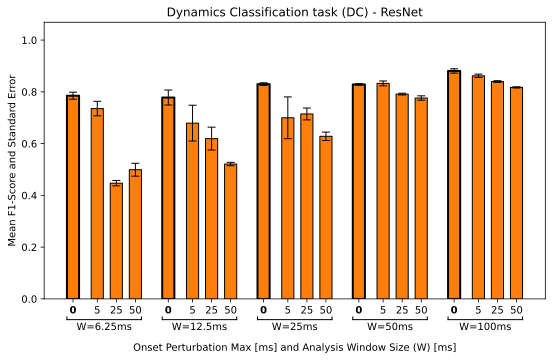

# Updated plots

After presenting the paper at the Audio Mostly conference, we received feedback from the audience, asking for the addition of errorbars to better drive our point.  

We added error bars representing the standard error of the mean across 3 cross-validation folds.  

The updated plots are presented below.

# 1. Pitch Detection Task (PD)
Plots in the paper for the first task are already box plots, so no need to add error bars.

# 2. Percussive/Pitched Binary Classification Task (BC)

Results with KNN:    

Results with ResNet:    

# 3. Dynamics Classification Task (DC)

Results with KNN:  

Results with ResNet:  

# 4. Multiclass Playing Technique Classification (TC)

Results with KNN:  

Results with ResNet:  
